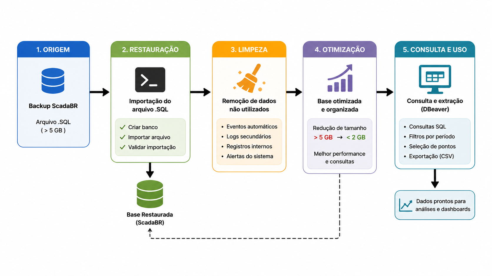

# Banco de Dados

Este repositório reúne a documentação técnica relacionada à recuperação, organização e utilização do banco de dados do projeto **ScadaBR-CTI**, aplicado ao monitoramento energético e operacional do **CTI Renato Archer**.

O objetivo desta seção é apresentar como a base histórica do sistema supervisório foi restaurada, tratada e estruturada para utilização em análises técnicas, dashboards e geração de indicadores operacionais.

---

# Visão Geral

Os dados utilizados no projeto são provenientes do sistema supervisório **ScadaBR**, responsável pelo armazenamento contínuo de medições operacionais e energéticas de diversos pontos monitorados na infraestrutura do CTI Renato Archer.

A base contém principalmente:

- Leituras de consumo elétrico
- Demandas de potência
- Estados operacionais
- Eventos e alarmes
- Registros históricos de sensores

Essas informações são armazenadas em formato de séries temporais, permitindo análises históricas e acompanhamento operacional da infraestrutura monitorada.

---

# Fluxo de Tratamento de Dados

Para garantir integridade, desempenho e organização da informação, o projeto segue um processo estruturado de recuperação, tratamento e disponibilização dos dados.

<p align="center">
  
</p>

---

# Origem da Base de Dados

A base original foi disponibilizada em formato de backup `.sql`, contendo a estrutura completa do sistema ScadaBR, incluindo tabelas, registros históricos e informações administrativas.

### Período dos Registros

- Início: **14/08/2019**
- Fim: **03/04/2023**

### Volume Inicial

O arquivo original possuía tamanho superior a:

**5 GB**

Devido ao elevado volume de informações, foi necessário recriar a base em ambiente controlado, permitindo melhor desempenho em consultas, limpeza de registros desnecessários e otimização estrutural.

---

# Ambiente Utilizado

### Banco de Dados

- MySQL 8.0
- MariaDB

### Ferramentas de Manipulação

- DBeaver
- Terminal do Windows

### Recursos Utilizados no Processo

- Comandos SQL para criação e recuperação da base
- Importação via linha de comando do MySQL
- Consultas e validações estruturais do banco

---

# Recuperação da Base de Dados

A restauração do banco foi realizada a partir de um arquivo de backup `.sql` exportado do ScadaBR. O arquivo utilizado no processo, já tratado e otimizado, encontra-se disponível na rede interna do CTI no diretório:

```text
\\gonzaga\projetos\ScadaLTS
```

O procedimento foi executado via terminal do Windows utilizando MySQL, abordagem escolhida por oferecer maior estabilidade no processamento de arquivos grandes.

## Etapas de Restauração do Backup `.sql`

### 1. Acessar o MySQL

```sql
mysql -u root -p
```

### 2. Criar um novo banco de dados

```sql
CREATE DATABASE scadabr;
```

### 3. Encerrar o terminal do MySQL

```sql
exit;
```

### 4. Importar o arquivo de backup

```sql
mysql -u root -p scadabr < "C:\caminho\arquivo.sql"
```

Neste comando:

- `scadabr` representa o banco criado anteriormente
- `"C:\caminho\arquivo.sql"` corresponde ao arquivo de backup exportado do sistema

### 5. Validar a importação

Após a conclusão da importação:

```sql
mysql -u root -p
```

```sql
USE scadabr;

SHOW TABLES;
```

Se as tabelas forem exibidas corretamente, a restauração foi concluída com sucesso.

---

# Tratamento e Limpeza dos Dados

Após a recuperação da base, foi realizado um processo de limpeza para remover informações administrativas que não eram relevantes para as análises energéticas.

Foram removidos principalmente:

- Eventos automáticos
- Logs secundários
- Registros internos do sistema

## Comandos Utilizados

```sql
USE scadabr;

TRUNCATE TABLE events;

TRUNCATE TABLE userEvents;
```

Esse processo reduziu significativamente o tamanho final da base e melhorou a performance das consultas analíticas.

---

# Resultado da Otimização

Após o tratamento:

- Base original: **mais de 5 GB**
- Base otimizada: **menos de 2 GB**

A otimização proporcionou melhorias em:

- Velocidade de consulta
- Exportação de dados
- Organização estrutural
- Performance geral do ambiente analítico

---

# Estrutura de Dados

As tabelas mais importantes para o projeto são:

### DataSources

Tabelas responsáveis pelas informações de configuração, origem e organização dos pontos monitorados no sistema supervisório.

### DataPoints

Tabela responsável pela identificação dos sensores, medidores e variáveis monitoradas.

### PointValues

Tabela que armazena os valores históricos registrados ao longo do tempo.

---

# Consulta e Extração de Dados

Após o tratamento da base, a ferramenta **DBeaver** foi utilizada para:

- Navegação entre tabelas
- Construção de consultas SQL
- Filtragem por período
- Seleção de sensores específicos
- Exportação de dados em CSV

Essas informações foram posteriormente integradas ao ambiente analítico desenvolvido em linguagem R.

---

# Aplicações no Projeto

Os dados extraídos da base são utilizados em:

- Perfis de carga elétrica
- Análises de demanda
- Comparações horárias e sazonais
- Dashboards interativos
- Indicadores operacionais
- Estudos de eficiência energética
- Detecção de anomalias

---

# Objetivo Estratégico

Transformar dados históricos e operacionais em informações estratégicas para apoio à tomada de decisão, permitindo:

- Redução de desperdícios energéticos
- Identificação de picos de consumo
- Melhor utilização da infraestrutura elétrica
- Apoio ao planejamento operacional
- Monitoramento contínuo do ambiente supervisionado

---

# Conclusão

A base encontra-se restaurada, tratada e integrada ao ecossistema analítico do projeto **ScadaBR-CTI**, servindo como núcleo principal das análises energéticas e operacionais desenvolvidas.

---

- **[Página Inicial](https://github.com/ScadaBR-CTI)**

