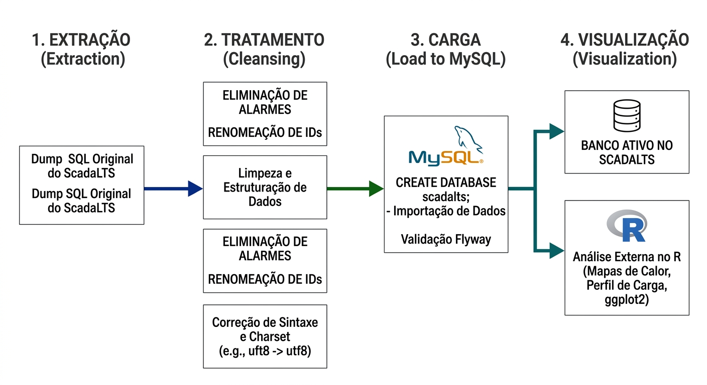

# Banco de Dados

Este repositório reúne informações técnicas relacionadas à estrutura, recuperação, organização e utilização do banco de dados empregado no projeto **ScadaBR-CTI**, aplicado ao monitoramento energético e operacional do **CTI Renato Archer**.

O objetivo desta documentação é apresentar de forma clara como os dados foram restaurados, tratados e preparados para análises posteriores, dashboards e geração de indicadores estratégicos.

---

## Visão Geral

Os dados utilizados neste projeto são provenientes do sistema supervisório **ScadaBR**, responsável pelo armazenamento contínuo de medições operacionais e energéticas de diversos pontos monitorados dentro da infraestrutura do CTI Renato Archer.

Essas informações incluem séries temporais de consumo elétrico, demanda de potência, estados operacionais e registros associados aos sensores distribuídos no ambiente monitorado.

A recuperação adequada dessa base tornou possível transformar um grande volume de dados históricos em uma estrutura organizada e pronta para análises técnicas.

---

## Fluxo de Tratamento de Dados
Para garantir que as informações coletadas no campo sejam confiáveis e prontas para análise, o projeto segue um processo estruturado de Extração, Tratamento e Carga (ETL). O diagrama resumido abaixo ilustra como os dados brutos do ScadaBR são transformados:

<p align="center">
  
</p>

---

## Origem dos Dados

O banco original foi disponibilizado em formato **.SQL**, contendo backup completo do sistema ScadaBR.

### Período dos Registros

* Início: **14/08/2019**
* Fim: **03/04/2023**

### Conteúdo do Backup

A base continha informações como:

* Leituras de medidores elétricos
* Histórico de sensores
* Demandas de potência
* Eventos do sistema
* Alarmes automáticos
* Registros administrativos
* Informações de usuários

---

## Volume Inicial de Dados

O arquivo original possuía tamanho superior a:

**5 GB**

Devido ao volume elevado, tornou-se necessário recriar a base em ambiente controlado, permitindo limpeza, otimização e consultas mais eficientes.

---

## Ambiente Utilizado

As ferramentas principais empregadas no processo foram:

### Banco de Dados

* MySQL 8.0
* MariaDB

### Manipulação e Consulta

* DBeaver

### Análise Posterior

* Linguagem R
* Shiny
* SQL

---

## Processo de Recuperação

A restauração da base foi realizada diretamente pelo terminal do Windows utilizando MySQL, opção escolhida por oferecer maior desempenho e estabilidade para arquivos grandes.

### Etapas Utilizadas

```sql
mysql -u root -p

CREATE DATABASE scadabr;

exit;

mysql -u root -p scadabr < "C:\caminho\arquivo.sql"

USE scadabr;

SHOW TABLES;
```

Após a importação, todas as tabelas originais do sistema passaram a estar disponíveis para consulta.

---

## Tratamento e Limpeza dos Dados

O banco original continha tabelas administrativas que não seriam necessárias para análises energéticas históricas.

Foram removidos principalmente registros de:

* Eventos automáticos
* Alertas internos
* Logs operacionais secundários

### Comandos Aplicados

```sql
USE scadabr;

TRUNCATE TABLE events;

TRUNCATE TABLE userEvents;
```

---

## Resultado da Otimização

Após o processo de limpeza:

* Base original: **+5 GB**
* Base tratada: **menos de 2 GB**

Essa redução melhorou significativamente:

* Velocidade de consultas
* Exportação de dados
* Performance geral
* Organização estrutural

---

## Estrutura de Dados Relevante

As tabelas mais importantes para o projeto concentram:

### DataPoints

Identificação de sensores e medidores monitorados.

### PointValues

Valores históricos medidos ao longo do tempo.

### Metadados

Informações técnicas de configuração dos pontos.

---

## Visualização e Extração

Após tratamento da base, a ferramenta **DBeaver** foi utilizada para:

* Navegação entre tabelas
* Criação de consultas SQL
* Filtros por período
* Seleção de sensores específicos
* Exportação em CSV

Essa etapa permitiu integrar os dados posteriormente ao ambiente analítico em R.

---

## Aplicações no Projeto

Os dados extraídos do banco são utilizados em:

* Gráficos de demanda elétrica
* Perfis de carga
* Comparações horárias e sazonais
* Estudos de eficiência energética
* Dashboards interativos
* Indicadores operacionais
* Detecção de anomalias

---

## Objetivo Estratégico

Transformar dados brutos operacionais em inteligência aplicada para:

* Redução de desperdícios
* Melhor uso da energia elétrica
* Identificação de picos de consumo
* Apoio à tomada de decisão
* Planejamento operacional

---

## Status Atual

Base restaurada, tratada e integrada ao ecossistema analítico do projeto **ScadaBR-CTI**, servindo como núcleo principal das análises energéticas desenvolvidas.

**[Página Inicial](https://github.com/ScadaBR-CTI)**

---

> Este banco de dados representa a base histórica e operacional necessária para conectar automação industrial, análise estatística e eficiência energética no CTI Renato Archer.
